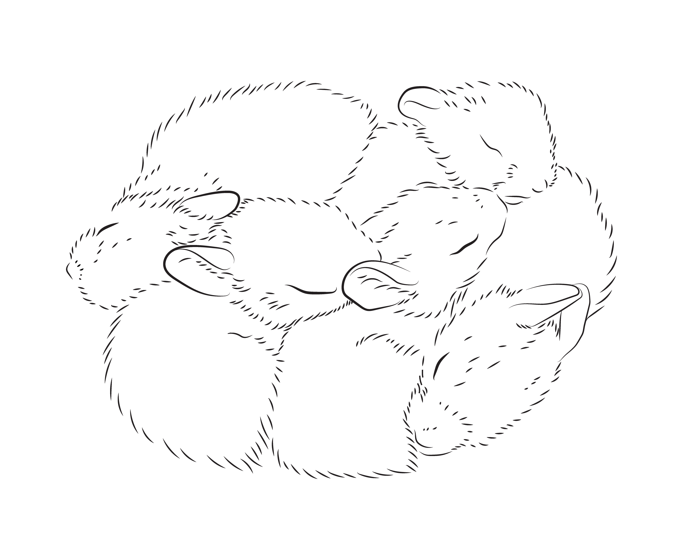

# Assignments

## How to Use This Module
As the semester progresses, information will be added to this module to supplement in-class instructions regarding your assignments. Each assignment has its own section, which will detail the due date, instructions, and any exrta information for the assignment. Once the assignment has been completed, this page will be updated to include submissions (where applicable) and general feedback from the instructor. You will also recieve private, personal feedback on your assignments separately. 

*Bunnies by Elissa Sorojsrisom for WRARI.*

## Assignment List

This is a simplified list of the assignments, the points they are worth, the learning objectives (LOs) they address, and the preferred software for each assignment. **Bolded** assignments will be evaluated for a grade, the rest will recieve completion points. 

Refer to the [Course Schedule](/vizcomm/structure) or specific assignment page for due dates. 

| Name                       | Points | Grade % | LOs   | Preferred  | Alternative |
| -------------------------- | ------ | ------- | ----- | ---------  | ----------- |
| Mood Board                 | 5      | 2%      | 2, 4  | Any browser|             |
| Design Slides              | 5      | 2%      | 4     | Keynote    | Google, Powerpoint|
| Full Template              | 10     | 4%      | 4     | Keynote    | Google, Powerpoint|
| **Narrative Pres.**        | **15** | 6%      | 4,5   | Keynote    | Google, Powerpoint|
| **Informational Pres.**    | **15** | 6%      | 4,5   | Keynote    | Google, Powerpoint|
| **Persuative Pres.**       | **30** | 12%     | 1,4,5 | Keynote    | Google, Powerpoint|
| Icons                      | 5      | 2%      | 3     | Affinity Designer | Adobe Illustrator|
| Simple Placeholder Illus.  | 5      | 2%      | 1,2,3 | Affinity Designer | Adobe Illustrator|
| Methods Illustration       | 5      | 2%      | 1,2   | Affinity Designer | Adobe Illustrator|
| Conceptual Framework       | 5      | 2%      | 2,3,5 | Affinity Designer | Adobe Illustrator|
| **Client Prompt**          | **10** | 4%      | 1,2   | Any word processor|      |
| Client Project             | 10     | 4%      | 1,2,3 | Affinity Designer | Adobe Illustrator|
| **Final Portfolio**        | **80** | 32%     | 1,2,3 | Layout program of choice ||
| **Participation**          | **50** | 20%     | 1,2,3 |           |              |
