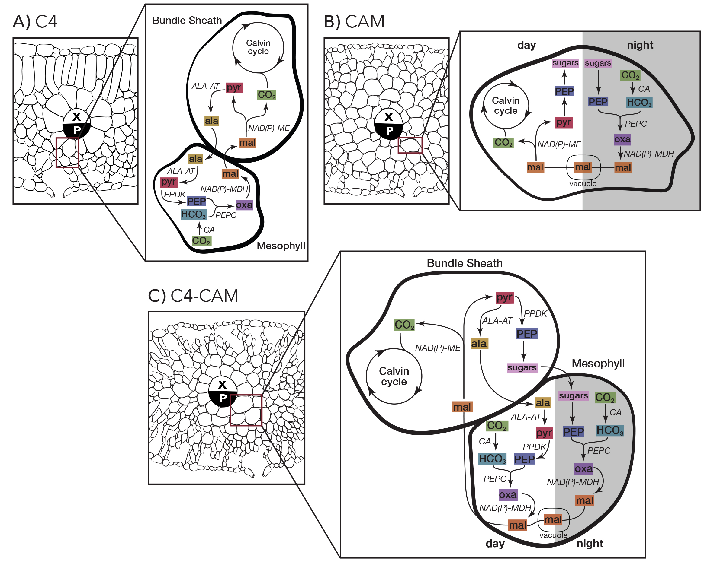

# Course Expectations

## Students
*Adherence to these expectations will affect your [Participation](/participation) Grade*
- **Attend every class session\***
- Take risks, embrace the possibility of failure
- Turn off your cell phone during class
- Listen to others and respect their views.
- Arrive on time and stay for the entire class period.
- Come to class prepared, with all assignments for the day completed ahead of time and any peer review conducted thoughtfully, well in advance (not minutes before the start of class).
- Engage actively throughout every class period. You are expected to actively work on course-related assignments during any in-class work time and provide feedback to your peers during and after their presentations.
- Take your own learning seriously. You will help establish your goals for the end of the course and work towards them throughout. You will be evaluated on your own criteria as well as the general criteria outlined in the [Evaluation](/grading) section.
- Improve your work by implementing feedback from your peers and the instructor
- Discuss concerns after class or during office hours

 \*  *Your attendance is integral to your own learning and the learning of your peers in this course. Only absences due to emergencies or illness will be excused. Please note the class meeting dates around holiday times - absences due to sports, holiday, or any non-emergency travel will not be tolerated and will negatively impact your grade. If you anticipate you will not be able to attend every class period, please do not register.* 

--
## Instructor
- Provide detailed, implementable feedback within a week of each assignment due date
- Keep an open mind to the needs of students and the challenges they are experiencing throughout the course and provide support when needed
- Turn off cell phone during class; no emailing
- Makes availability for student questions and concerns 
- Always open to recieving studdent feedback

--

*Biochemistry of leaves by Elissa Sorojsrisom for Dr. Erika Edwards, Yale University.*