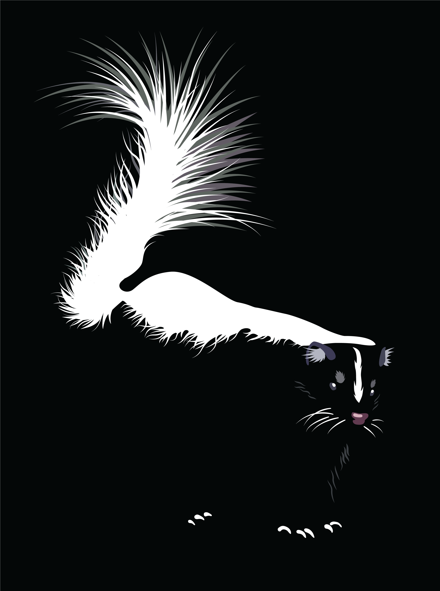

# Final Portfolio

Your final for this course will be a portfolio showcasing the illustration and design work you performed throughout the sesmester. All your visual assignments were awarded completion poiints, and you may choose to includue any or all of them in your final portfolio, in addition to two new illustrations. The portfolio will be evluated for a grade out of 80 points. 

## Requirements
1. You must include at least 6 illustrations (in addition to the client prompt). Each illustration must be accompanied by a title, date of completion, and medium (software) used to create it. One illustration, or body of illustrations (e.g. iccons), per spread. 
2. At least 3 illustratioins must be work you submitted previously in the course. For these three illustrations, you will implement changes based on the comments from the instructor and your peers and the edited illustration must be accompanied by a short paragraph explaining what advice you did and didn't take and why. 
3. A progress spread for one of your illustrations showing the progression from planning, skteches, 1st draft, and final draft (and any other steps in between). 
4. Your client prompt illustration includiding the prompt, pertinent communicatio between you and the client, and the final piece. This illustration does not count towards your minimum of 6. 
5. Design spread showcasing your presentation slide design. Refer to style guides and brand identity manuals for layout ideas
6. Two of your spreads must include a paragraph that explains the purpose of the work, what it is trying to accomplish, and how it should be used
7. A cover letter describing you, your aesthetic, and the work within the portfolio. This should take on a narrative structure that entices the reader to look at your portfolio. 
8. A written reflection, no more than one page, addressing your progress through the semester. Some things you might write about: 
	* how well you think you achieved the goals you iedntified at the beginning of the semester
	* challenges you faced and overcame
	* specific points of improvement in your illustration or verbal presentations
	* hings you would've done differently if you had more time 
	* your favorite and least favorite parts of the course and why
	* people you enjoyed meeting and working with over the semester.  

## Format
The format your portfolio takes is up to you. You may decide to build a website or have your pieces printed and assembled in a book. You may also think outsided the box and come up with your own format!

We will discuss the logistics of putting together your final portfolio in class. 

*Skunk by Elissa Sorojsrisom.*
