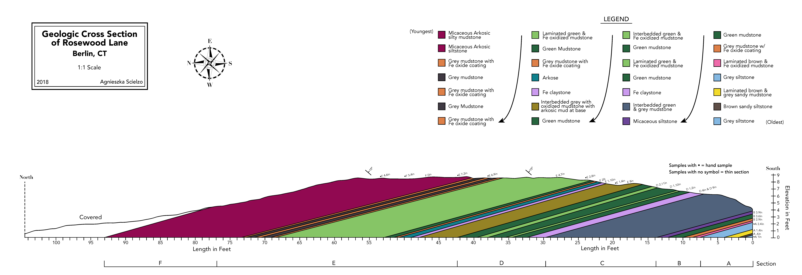

# Evaluation & Grading

Your learning objectives will be set by both the instructor and yourself, based on your pre-course survey. Below are a list of course learning objectives for all students. 1-3  additional learning objectives will be identified by you and the instructor at the beginning on the course. These learning objecives will form the basis of how your work will be assessed.

## Student Learning Objectives
By the end of the course, students will be able to:

1. Utilize a working understanding of digital image files, including file types, size, resolution, and software used to generate these files.
2. Implement color theory 
3. Create vector illustrations in Affinity Designer or Adobe Illustrator. 
4. Design and utilize a custom-build theme in Keynote or other presentation software to create a cohesive and effective presentation
5. Communicate their own research with confidence, utilizing custom-made visual aides to communicate ideas clearly for their intended audience
6. Evaluate the effectiveness of visual media based on visual and conceptual clarity.

*Rosewood Cross Section by Elissa Sorojsrisom.*

## Grading
This course is built on the idea that feedback and iteration are essential for effective communication. Therefore, the importance of assignments and presentations, in terms of their impact on your grade, increases throughout the semester. There are four ways you will recieve points in this course: completion points for illustration assignments throughout the semester, graded presentations, a participation grade, and a graded final portfolio. See the assignment list for point and grade % breakdowns for each portion. 

### Completion Points
All visual deliverables recieve a *completion grade* for the first draft. Your illustration must meet minimum requirements laid out in the rubric for each assignment in order to earn completion points. You will recieve feedback on all of your assignments within a week of turning them in and  can incorporate these edited assignments into your final portfolio. 

### Presentations
Each presentation will be graded with the final presentations worth twice as much as the first two. General expectations for presentations are outlinedd in the [Presentations](/Presentatitions/) section of the syllabus, but specifics will also be covered in class and provided via the [Assignments Module](/assignments/) ahead of presentation dates. Rubrics for each presentation will also be provided. 

### Participation
The participation grade reflects the verbal and written feedback you provide to your peers throughout the course. Specifics are provided in the [Participation](/participation) section.

### Final Portfolio
The purpose of completion grades throughout the semester is to give you the opportunity to refine your work and present it as a complete portfolio at the end of the term. Ideally, much of the work that will go into your final portfolio will be completed throughout the semester. For some of the work included in your portfolio, you will be required to write a summary of how you changed the wokr to incorporate feedback from the instrructor and your peers. Refer to the [Final Portfolio](/final/) section for completet details. 

## Assignment List

This is a simplified list of the assignments, the points they are worth, the learning objectives (LOs) they address, and the preferred software for each assignment. **Bolded** assignments will be evaluated for a grade, the rest will recieve completion points. 

More detail will be provided for each assignment in class and in the [Assignments Module](/assignments/) this website as they are assigned. Refer to the [Course Schedule](/structure/) for due dates. 

| Name                       | Points | Grade % | LOs   | Preferred  | Alternative |
| -------------------------- | ------ | ------- | ----- | ---------  | ----------- |
| Mood Board                 | 5      | 2%      | 2, 4  | Any browser|             |
| Design Slides              | 5      | 2%      | 4     | Keynote    | Google, Powerpoint|
| Full Template              | 10     | 4%      | 4     | Keynote    | Google, Powerpoint|
| **Narrative Pres.**        | **15** | 6%      | 4,5   | Keynote    | Google, Powerpoint|
| **Informational Pres.**    | **15** | 6%      | 4,5   | Keynote    | Google, Powerpoint|
| **Persuative Pres.**       | **30** | 12%     | 1,4,5 | Keynote    | Google, Powerpoint|
| Icons                      | 5      | 2%      | 3     | Affinity Designer | Adobe Illustrator|
| Simple Placeholder Illus.  | 5      | 2%      | 1,2,3 | Affinity Designer | Adobe Illustrator|
| Methods Illustration       | 5      | 2%      | 1,2   | Affinity Designer | Adobe Illustrator|
| Conceptual Framework       | 5      | 2%      | 2,3,5 | Affinity Designer | Adobe Illustrator|
| **Client Prompt**          | **10** | 4%      | 1,2   | Any word processor|      |
| Client Project             | 10     | 4%      | 1,2,3 | Affinity Designer | Adobe Illustrator|
| **Final Portfolio**        | **80** | 32%     | 1,2,3 | Layout program of choice ||
| **Participation**          | **50** | 20%     | 1,2,3 |           |              |

