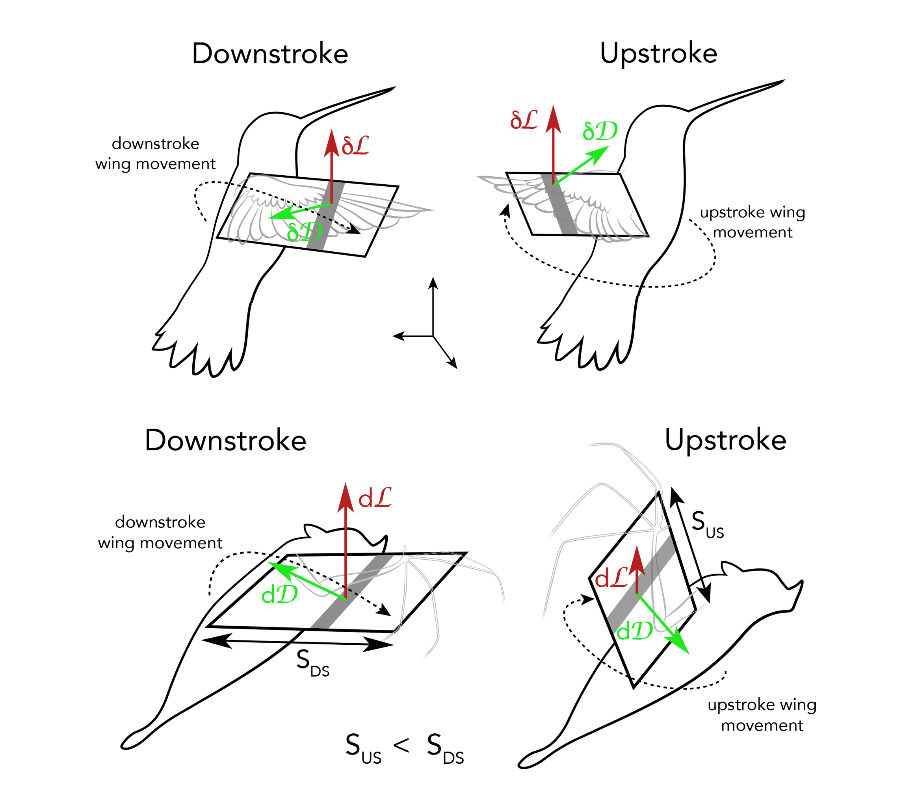

# Welcome to VizComm for Scientists

!!! tip

    Announcements and links to current course content will be posted here, so check back often!

???+ question "Trying to Register?"

    **Trying to register for the course?** Fill out the pre-course survey! 

    You must fill out the pre-course survey to be admitted to the course. Students will be chosen based on alignment of interests with the course and percieved compatibility between students. 

    Before you start the survey, a few things to note:

    * Make sure you have at least 30 minutes to complete the survey
    * This survey is essentially the first assignment in the course and will lay the groundwork for future assignments, so take it seriously!
    * If you want some time to think, refer to this static copy of all the survey questions and references 

    
[Take the Survey!](#){ .md-button }

**Meetings**:         Tuesdays and Thursdays 10am-noon 
**Location**:          Schermerhorn Ext. 1012 
**Instructor**:        Elissa Sorojsrisom 
**Office Hours**:   Mondays 2-4pm, Friday 9-11am or by appointment

This is an advanced seminar, designed for no more than 12 students. The target audience is students involved in science research, although students from other disciplines may be admitted to the course. 

A major outcome of this couse is to provide students with the tools, skills, and confidence to produce visuals and utilize them effectively in presentations of their research. 

--

--