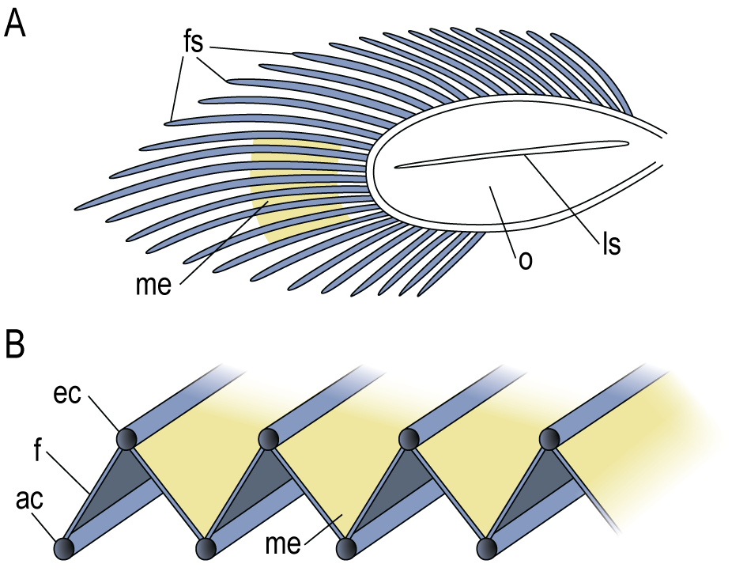
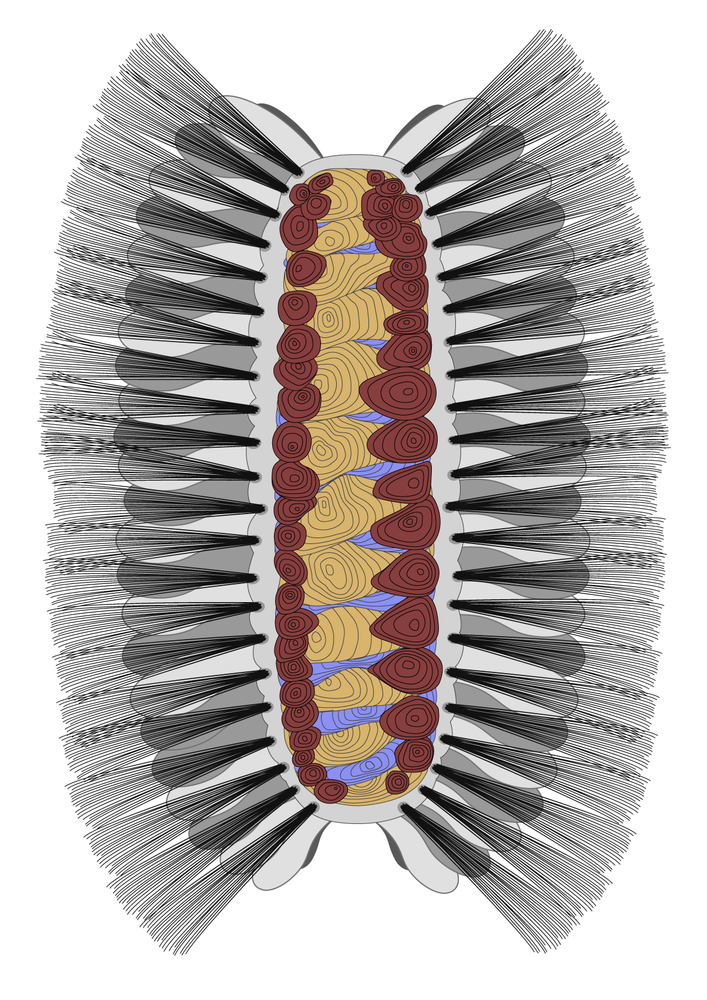

# Overview

???+ abstract "Annotation"

    This is an advanced seminar, designed for graduate and advanced undergraduate students currently involved in scientific research. The course is designed to reflect similar activities these students are likely to encounter in an academic career (e.g. as a postdoc, professor, researcher, etc) and match the pace of work in an academic environment. Students will learn two suites of skills: vector illustration and verbal slide presentation. The goal is to give them a solid foundation in the minimum number of tools necessary to produce effective visual illustrations and then have them practice using those visualizations while developing verbal presentation skills. The entire course is scaffolded, such that most initial assignments (awarded completion points) will be incorporated into future graded assignments.

    The students are give the opportunity to shape their own learning by defining their own learning objectives early in the semester, guided by a one-on-one meeting with the professor. Additionally, course content will be tailored to the interest of the students based on the pre-course survey results and initial meetings. The plan is to convince Columbia (or whichever institution) to buy licenses for all the software, which will increase accessibility for the students. 

**Meetings**:         Tuesdays and Thursdays 10am-noon 
**Location**:          Schermerhorn Ext. 1012 
**Instructor**:        Elissa Sorojsrisom ([ess2239@columbia.edu](mailto:ess2239@columbia.edu))  
**Office Hours**:   Mondays 2-4pm, Friday 9-11am or by appointment

**Course Requirements**: You should be involved in research and interested in communication. You will need access to a computer and the ability to install software onto that computer. If this poses a challenge for you please reach out to the instructor, who will work with you to find a solution.

*Trilobite Appendage by Elissa Sorojsrisom for Dr. Derek Briggs, Yale Peabody Museum.*

This is an advanced seminar, designed for no more than 12 students. The target audience is students involved in science research, although students from other disciplines may be admitted to the course. 

A major outcome of this couse is to provide students with the tools, skills, and confidence to produce visuals and utilize them effectively in presentations of their research. 

??? success "Learning Objectives"

    By the end of the course, students will be able to:

	1. Utilize a working understanding of digital image files, including file types, size, resolution, and software used to generate these files.
	2. Implement color theory 
	3. Create vector illustrations in Affinity Designer or Adobe Illustrator. 
	4. Design and utilize a custom-build theme in Keynote or other presentation software to create a cohesive and effective presentation
	5. Communicate their own research with confidence, utilizing custom-made visual aides to communicate ideas clearly for their intended audience
	6. Evaluate the effectiveness of visual media based on visual and conceptual clarity.

This course is designed for advanced students involved in research who are interested in learning how to communicate scientific ideas visually. Visual communication includes supplementary images that may be used in presentations and documents, figures appropriate for publication in scientific journals, and high-level conceptual diagrams which convey complex concepts. In this course you will not only learn how to create these images, you will learn visual literacy: the ability to find, interpret, evaluate, and use visual media effectively. You will practice communicating topics relevant to your own research to your peers and play an important role in providing feedback to them as they do the same. The only requirement for this course is that you are involved with research and interested in communicating science topics. No background in art or visualization is expected. This course will be challenging, requiring substantial work and preparation outside of class. You will be expected to take your role as a student and a peer seriously and contribute to a welcoming and constructive learning environment for all. Please note, this is not a data visualization class and though the visualizations we create in this class may include data (e.g. graphs, tables, etc) at times, this course will not cover the creation of data visualizations.

## Instructor Information

Elissa Sorojsrisom is a joint graduate student in the E3B (Ecology, Evolutionary, and Environmental Biology) Department at Columbia University and the New York Botanical Garden. She studies the evolution and development of ferns. She is also a freelance scientific illustrator. 

email: [ess2239@columbia.edu](mailto:ess2239@columbia.edu)  

*Tomotiid Reconstruction by Elissa Sorojsrisom for Dr. Luke Parry & Dr. Jakob Vinther.*